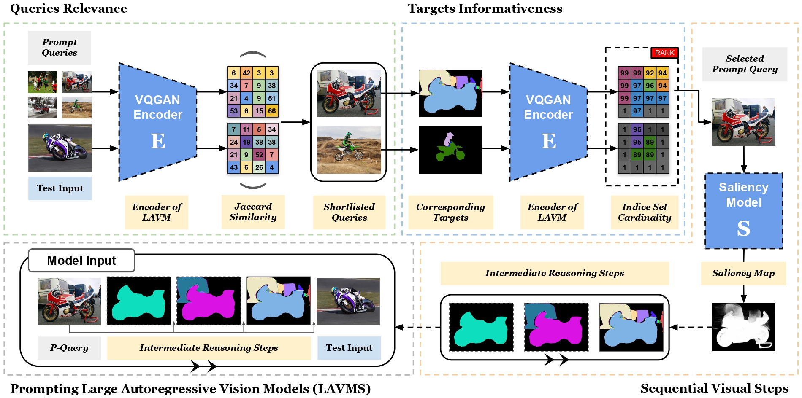

## Chain-of-Focus Prompting: Leveraging Sequential Visual Cues to Prompt Large Autoregressive Vision Models

We propose a new visual prompting paradigm called Chain-of-Focus (CoF) prompting. Our approach mimics progressive thinking by incorporating intermediate steps into visual prompts and addresses the challenge of prompt customization by directly selecting the most informative prompts relative to test inputs. Three models are selected to evaluate the results of COF prompting. 300M and 1B models are from [DeLVM](https://github.com/ggjy/DeLVM), 7B model is from [LVM](https://github.com/ytongbai/LVM)


## Abstract

In-context learning (ICL) has revolutionized natural language processing by enabling models to adapt to diverse tasks with only a few illustrative examples. However, the exploration of ICL within the field of computer vision remains limited. Inspired by Chain-of-Thought (CoT) prompting in the language domain, we propose Chain-of-Focus (CoF) Prompting, which enhances vision models by enabling step-by-step visual comprehension. CoF Prompting addresses the challenges of absent logical structure in visual data by generating intermediate reasoning steps through visual saliency. Moreover, it provides a solution for creating tailored prompts from visual inputs by selecting contextually informative prompts based on query similarity and target richness. The significance of CoF prompting is demonstrated by the recent introduction of Large Autoregressive Vision Models (LAVMs), which predict downstream targets via in-context learning with pure visual input. By integrating intermediate reasoning steps into visual prompts and effectively selecting the informative ones, the LAVMs are capable of generating significantly better inferences. Extensive experiments on downstream visual understanding tasks validate the effectiveness of our proposed method for visual in-context learning.

## Set up
1. For 300M and 1B models, follow [DeLVM](https://github.com/ggjy/DeLVM) to set up [InternLM-v0.2.1dev20231121](https://github.com/InternLM/InternLM/tree/v0.2.1dev20231121). For 7B model, follow [LVM](https://github.com/ytongbai/LVM) to set up LVM. 

2. Saliency Model: Put u2net.pth or u2netp.pth in "./prompting/U_2_Net/saved_models/u2net" or "./prompting/U_2_Net/saved_models/u2netp"
3. Coco Dataset for Segmentation and Pose Estimation: Download "coco2017" training and validation dataset, put under folder "dataset/coco/train2017/" and "dataset/coco/val2017/" accordingly, path to test img will be "dataset/coco/val2017/xxx.jpg".
4. Annotations of Coco: for example "dataset/annotations/seg_val2017.json" for segmentation
5. DeLVM weights: download the weights to "InternLM/weight/llama_1b_hf" and "InternLM/weight/vqgan-f16-8192-laion"
6. LVM weights: download the weights to "LVM/weights/lvm" and "LVM/vqvae_ckpts"


## Generating Segmentation and Pose Detection prompts
```
python ./prompting/generate_cof_prompt_seg.py  
python ./prompting/generate_cof_prompt_pose.py  
```

## Run inference using generated prompts on 300M and 1B models
```
python ./InternLM/cof_inference_seg_1b.py  
python ./InternLM/cof_inference_pose_1b.py  
```

## Run inference using generated prompts on 7B model
```
python ./LVM/cof_inference_seg_7b.py  
python ./LVM/cof_inference_pose_7b.py  
```

Check visualized results in the "Results" folder.

## Install environment
### Requirements
- Python == 3.9
```
git clone https://github.com/tmllab/2025_ICLR_COF.git
cd 2025_ICLR_COF
pip install -r requirements.txt
```

## Quick start inferencing
We have sampled some COF prompts for the segmentation task. The generated prompts are store under "./prompting/coco_seg/cof_prompts", and the images to be referenced are store under the folder "./dataset/coco/val2017" 
